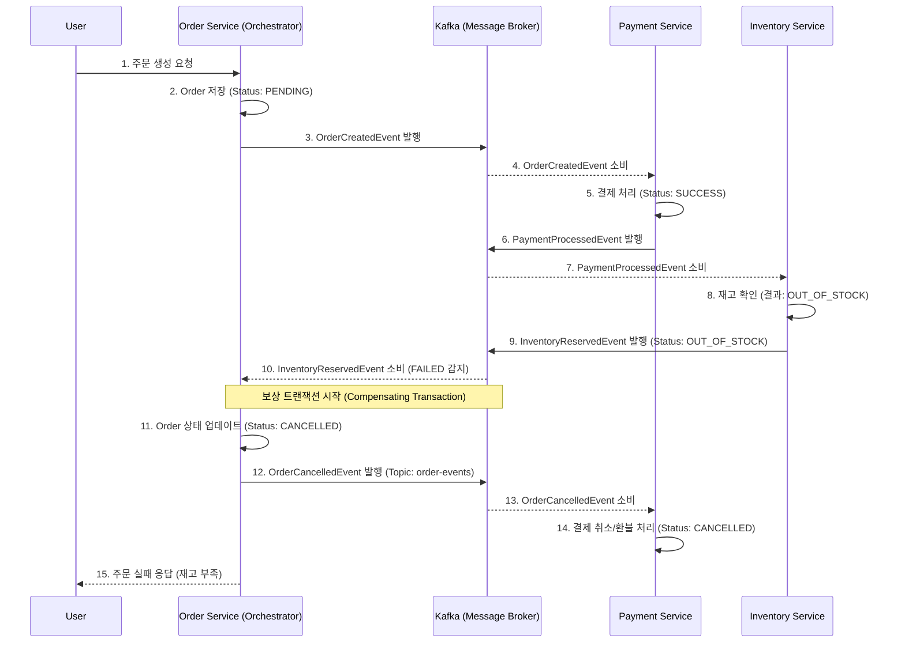

# MSA SAGA Error Flow (Compensation Scenario)

이 다이어그램은 재고 부족 시 결제를 취소(Refund)하고 주문을 취소하는 보상 트랜잭션 흐름을 보여줍니다.

```mermaid
sequenceDiagram
    participant U as User
    participant O as Order Service (Orchestrator)
    participant K as Kafka (Message Broker)
    participant P as Payment Service
    participant I as Inventory Service

    U->>O: 1. 주문 생성 요청
    O->>O: 2. Order 저장 (Status: PENDING)
    O->>K: 3. OrderCreatedEvent 발행
    K-->>P: 4. OrderCreatedEvent 소비
    P->>P: 5. 결제 처리 (Status: SUCCESS)
    P->>K: 6. PaymentProcessedEvent 발행
    K-->>I: 7. PaymentProcessedEvent 소비
    I->>I: 8. 재고 확인 (결과: OUT_OF_STOCK)
    I->>K: 9. InventoryReservedEvent 발행 (Status: OUT_OF_STOCK)
    K-->>O: 10. InventoryReservedEvent 소비 (FAILED 감지)
    
    Note over O, K: 보상 트랜잭션 시작 (Compensating Transaction)
    
    O->>O: 11. Order 상태 업데이트 (Status: CANCELLED)
    O->>K: 12. OrderCancelledEvent 발행 (Topic: order-events)
    K-->>P: 13. OrderCancelledEvent 소비
    P->>P: 14. 결제 취소/환불 처리 (Status: CANCELLED)
    
    O-->>U: 15. 주문 실패 응답 (재고 부족)
```
