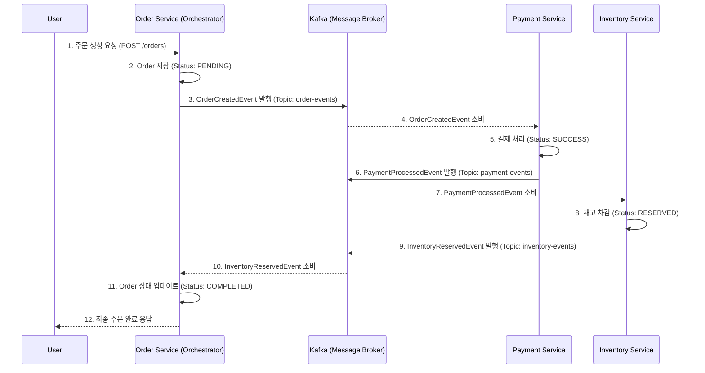

# MSA SAGA Normal Flow (Success Scenario)

이 다이어그램은 주문 생성부터 결제 완료, 재고 예약까지 모든 과정이 성공적으로 완료되는 흐름을 보여줍니다.

```mermaid
sequenceDiagram
    participant U as User
    participant O as Order Service (Orchestrator)
    participant K as Kafka (Message Broker)
    participant P as Payment Service
    participant I as Inventory Service

    U->>O: 1. 주문 생성 요청 (POST /orders)
    O->>O: 2. Order 저장 (Status: PENDING)
    O->>K: 3. OrderCreatedEvent 발행 (Topic: order-events)
    K-->>P: 4. OrderCreatedEvent 소비
    P->>P: 5. 결제 처리 (Status: SUCCESS)
    P->>K: 6. PaymentProcessedEvent 발행 (Topic: payment-events)
    K-->>I: 7. PaymentProcessedEvent 소비
    I->>I: 8. 재고 차감 (Status: RESERVED)
    I->>K: 9. InventoryReservedEvent 발행 (Topic: inventory-events)
    K-->>O: 10. InventoryReservedEvent 소비
    O->>O: 11. Order 상태 업데이트 (Status: COMPLETED)
    O-->>U: 12. 최종 주문 완료 응답
```
